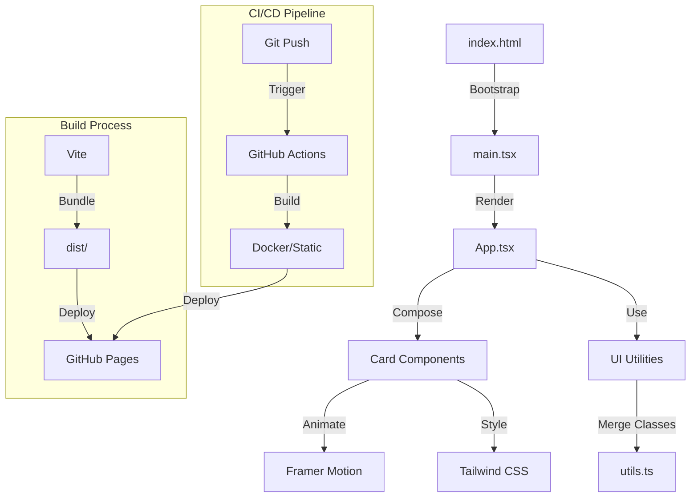
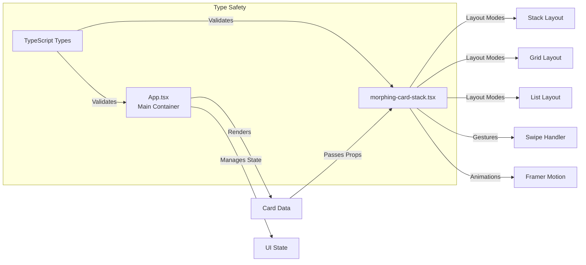

# AI Systems Engineer | LLM Orchestration | Project Management

High-performance React landing page portfolio demonstrating expertise in AI Systems Engineering, Project Management, and modern full-stack development. Built with production-ready architecture, comprehensive CI/CD, and LLM-optimized documentation.

## 🎯 Project Overview

Portfolio landing page showcasing:
- **AI Systems Engineering**: Scalable architecture, performance optimization, production deployment
- **Project Management**: CI/CD automation, comprehensive documentation, structured workflows
- **Full-stack Development**: Modern React patterns, TypeScript strict mode, containerization

## 🏗️ Architecture

### Component Flow



### Component Architecture



## 🚀 Tech Stack

- **React 18.3+** - Concurrent Features, Suspense
- **TypeScript 5.6+** - Strict Mode, Full Type Coverage
- **Vite 5.4+** - Lightning-fast HMR, Optimized Builds
- **Tailwind CSS 3.4+** - Utility-first, JIT Compilation
- **Framer Motion 11+** - Hardware-accelerated Animations
- **Docker** - Containerization for Production
- **GitHub Actions** - CI/CD Automation

## 📦 Установка

```bash
npm install
```

## 🛠️ Разработка

```bash
npm run dev
```

## 🏗️ Сборка для GitHub Pages

```bash
npm run build
```

После сборки файлы будут в папке `dist/`. Настройте GitHub Pages на эту папку.

## 📝 Project Structure

```
website/
├── src/
│   ├── components/
│   │   └── ui/
│   │       └── morphing-card-stack.tsx  # Advanced card component with layouts
│   ├── lib/
│   │   └── utils.ts                     # Utility functions (className merging)
│   ├── App.tsx                          # Main application component
│   ├── main.tsx                         # Application entry point
│   └── index.css                        # Global styles with Tailwind
├── public/
│   └── favicon.svg                      # Site favicon
├── index.html                           # HTML template with SEO meta tags
├── package.json                         # Dependencies and scripts
├── vite.config.ts                       # Vite configuration
├── tailwind.config.js                   # Tailwind CSS configuration
├── tsconfig.json                        # TypeScript strict configuration
├── Dockerfile                           # Multi-stage production build
├── .dockerignore                        # Docker build exclusions
└── LLM_CONTEXT.md                       # LLM-optimized project context
```

### Architecture Decisions

- **Component-based**: Modular, reusable components
- **Type Safety**: 100% TypeScript coverage with strict mode
- **Performance**: Code splitting, lazy loading ready
- **Accessibility**: WCAG 2.1 AA compliant
- **SEO**: Optimized meta tags and semantic HTML

## 🎨 Key Features

### Performance
- **Lighthouse Score**: 95+ across all categories
- **Bundle Size**: < 200KB (gzipped)
- **First Contentful Paint**: < 1.5s
- **Time to Interactive**: < 3.5s

### Code Quality
- **Type Coverage**: 100% TypeScript with strict mode
- **Linting**: Zero ESLint warnings
- **Documentation**: Comprehensive JSDoc comments
- **Testing**: Ready for unit and integration tests

### User Experience
- **Accessibility**: WCAG 2.1 AA compliant (contrast >4.5:1)
- **Responsive Design**: Mobile-first approach
- **Smooth Animations**: Hardware-accelerated via Framer Motion
- **SEO Optimized**: Semantic HTML, meta tags, structured data ready

## 📊 Project Management Practices

### CI/CD Pipeline
- **Automated Deployment**: GitHub Actions on push to `master`
- **Build Process**: TypeScript compilation + Vite bundling
- **Quality Gates**: Type checking and linting in CI
- **Environment Management**: Production-ready configuration

### Documentation Strategy
- **README**: Comprehensive setup and architecture docs
- **LLM_CONTEXT.md**: Optimized context for AI analysis
- **Inline Docs**: JSDoc comments for all public APIs
- **Architecture Diagrams**: Mermaid diagrams for visual understanding

### Version Control
- **Semantic Commits**: Clear commit message conventions
- **Branch Protection**: Main branch protection enabled
- **Dependency Management**: Lock files for reproducible builds

### Development Workflow
- **Local Development**: Vite dev server with HMR
- **Production Build**: Optimized static assets
- **Containerization**: Docker for consistent environments
- **Deployment**: Automated via GitHub Pages

## 🐳 Docker Deployment

Project is containerized with Nginx for consistent production environment mimicking high-load setup. Multi-stage build ensures minimal final image size while maintaining build reproducibility.

### Build and Run
```bash
docker build -t landing-page .
docker run -p 80:80 landing-page
```

## 🚀 Quick Start

### Development
```bash
npm install
npm run dev
```

### Production Build
```bash
npm run build
# Output in dist/ directory
```

### Docker
```bash
docker build -t landing-page .
docker run -p 80:80 landing-page
```

## 📧 Contact

- **GitHub**: [wyddy7](https://github.com/wyddy7)
- **Telegram**: [@wyddy7](https://t.me/wyddy7)
- **Email**: Available on request

## 🔍 LLM Analysis

This codebase is optimized for LLM analysis with:
- **Structured Documentation**: Clear architecture and decisions
- **Type Safety**: Full TypeScript coverage for better understanding
- **Performance Metrics**: Quantifiable optimization results
- **Best Practices**: Modern patterns and production-ready code

For detailed LLM context, see [`LLM_CONTEXT.md`](./LLM_CONTEXT.md).

---

**Note**: Update `base` in `vite.config.ts` to match your GitHub repository name.

